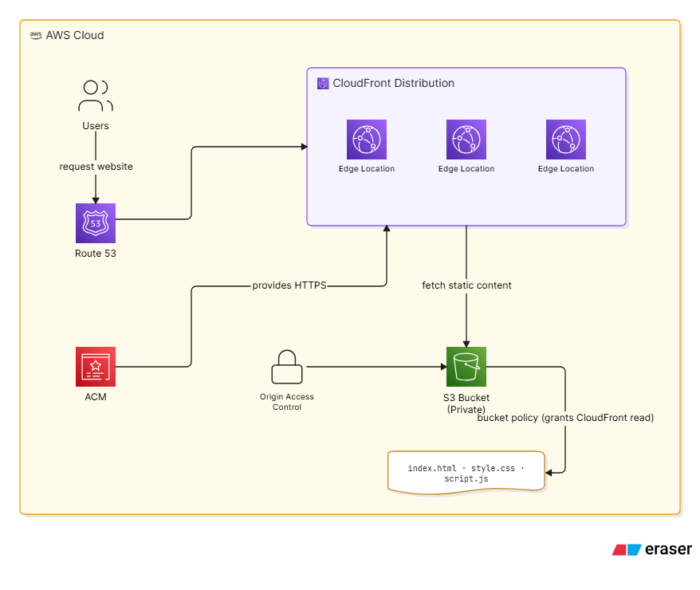

# Static Website Hosting — S3 + CloudFront (Terraform)

## Overview
Production-pattern static site hosting on AWS: a private S3 bucket serves content exclusively through CloudFront, with public bucket access fully blocked and access restricted to CloudFront via Origin Access Control (OAC). Provisioned entirely with Terraform.


## Architecture



> **Note:** The diagram includes Route 53 and ACM for a custom domain + managed HTTPS certificate. The current deployment uses CloudFront's default certificate (`*.cloudfront.net`) — no custom domain is attached yet. See [Next Steps](#next-steps) for the plan to close that gap.

### Request flow (as currently deployed)
```
User -> CloudFront (HTTPS, default cert) -> S3 Bucket (private, OAC-restricted)
```

### Why the bucket is private
The S3 bucket has all public access blocked (`block_public_acls`, `block_public_policy`, `ignore_public_acls`, `restrict_public_buckets` all `true`). The only way to reach the objects is through CloudFront, which authenticates to S3 using Origin Access Control — a signed request CloudFront generates per-request. The bucket policy grants `s3:GetObject` exclusively to the CloudFront service principal, scoped to this specific distribution's ARN via a `Condition` block. This means:
- No direct S3 URL for any file ever works
- No accidental public bucket exposure
- Only traffic passing through this exact CloudFront distribution can read objects

## Components

| Resource | Purpose |
|---|---|
| `aws_s3_bucket` | Stores site files (`index.html`, `style.css`, `script.js`) |
| `aws_s3_bucket_public_access_block` | Blocks all public access at the bucket level |
| `aws_cloudfront_origin_access_control` | Lets CloudFront sign requests to the private bucket |
| `aws_s3_bucket_policy` | Grants read access to CloudFront only, scoped by distribution ARN |
| `aws_s3_object` (xN, via `for_each`) | Uploads every file under `www/`, with correct `content_type` per extension |
| `aws_cloudfront_distribution` | Global CDN, HTTPS enforced, `index.html` as default root object |

## Prerequisites

- AWS CLI configured with a named profile
- Terraform >= 1.0
- Site files present under `www/` (`index.html`, `style.css`, `script.js`)

## Deployment

```bash
terraform init
terraform plan
terraform apply
```

Terraform will output the CloudFront domain once complete. First-time deploys take 5-15 minutes for the distribution to fully propagate before it's reachable — a fresh distribution returning `AccessDenied` or a timeout in that window is expected, not a bug.

## Updating Site Content

Any file added, removed, or changed under `www/` is picked up automatically by the `for_each` on `fileset()` — re-run `terraform apply` after editing site files. Note: CloudFront caches responses (`default_ttl = 3600`), so a content change may not appear immediately without a cache invalidation:

```bash
aws cloudfront create-invalidation --distribution-id <ID> --paths "/*"
```

## Issues Hit and Fixed During Build

**1. Hardcoded placeholder bucket reference**
Policy and origin blocks referenced `aws_s3_bucket.example` — a leftover from the tutorial this was adapted from. The actual resource is named `firstbucket`. Fixed all references to match the real resource name.

**2. Wrong IAM principal type in bucket policy**
Policy granted access via `"Principal": {"AWS": "cloudfront.amazonaws.com"}`. `AWS`-type principals are for account/IAM ARNs; a service principal requires `"Service": "cloudfront.amazonaws.com"`. Left uncorrected, CloudFront would never have been authorized to read the bucket regardless of any other configuration.

**3. Invalid IAM JSON casing**
Policy used lowercase `condition` / `stringEquals`, which AWS's policy parser doesn't recognize — it silently rejected the whole policy at `apply` time with `MalformedPolicy: Unknown field condition`. IAM/S3 policy keys are case-sensitive: `Condition`, `StringEquals`.

**4. Broken file path syntax in `aws_s3_object`**
`source` and `etag` used `"${path.module}/www}/${each.value}"` — a stray `}` mid-string. This surfaced late, only once earlier bugs were fixed, as a `filemd5: file not found` error during apply. Corrected the interpolation syntax.

**5. Unused ACM data source lookups**
`data.tf` contained `aws_acm_certificate` data sources querying for a certificate that was never requested, since this deployment uses CloudFront's default certificate rather than a custom domain. These failed with `empty result` on every plan. Removed, since there's nothing for them to look up in the current architecture.

## Known Limitations

- No custom domain — served only via the CloudFront-assigned `*.cloudfront.net` URL
- No cache invalidation automation — manual `aws cloudfront create-invalidation` required after content updates
- No CI/CD — deploys are manual (`terraform apply`)

## Next Steps

- Attach a custom domain via Route 53 + ACM (cert must be requested in `us-east-1` for CloudFront)
- Automate deploys with GitHub Actions (`terraform apply` on push to `main`, plus automatic cache invalidation)
- Add a custom error page (404) instead of CloudFront's default error response

## Cleanup

```bash
terraform destroy
```

Removes the S3 bucket, all objects, the bucket policy, OAC, and the CloudFront distribution.
